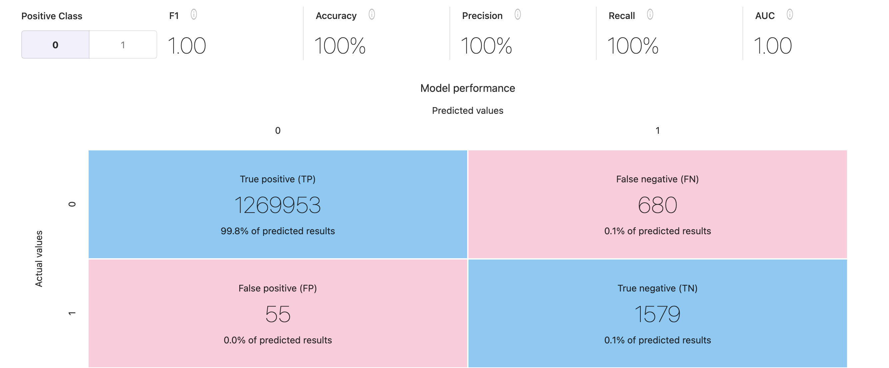

# AWS-ML-Blackbelt-BankingFraud

## Results of Sagemaker Canvas Project

As an initial step to using the dataset and to set a benchmark for performance, I created a Sagemaker Canvas training job on the day that Canvas was released using the bank fraud data. 

We will use this Canvas Auto-ML job as a baseline for our modeling because it took about 10 minutes to start training.

Here is the confusion matrix:

Unfortunately we likely should have inverted positive and negative classes so that "positive" means "is fraud."  Simply inverting from this matrix we see 

TN = 1269953
TP = 1579
FN = 55
FP = 680

p = precision = TP/(TP+FP) = 0.699
r = recall = TP/(TP+FN) = 0.966

F1 = 2 / (1/p + 1/r) = 0.811

## Results of base-line ML Model in the Banking Fraud Data Exploration notebook:

See this .

 GradientBoostingClassifier confusion matrix:
[[1561969      59]
 [     78    1984]] 
 F1 score:  0.96663 +- 0.00014

Note that this score is much improved over our AutoML Canvas results, probably due to the feature engineering we have applied, including a one-period lookback and account balance comparisons that are important in the heuristic.  Of course, we want to use a more sophisticate approach using hyperparameter tuning, but this is an improvement nonetheless.

Note that this notebook is designed for the purpose of reverse-engineering the simulated fraud data (the heuristic we define there works very well) mostly for the purpose of creating an adjusted dataset for testing in parallel with the original dataset in our MLOps pipeline.  The main outcome of this notebook, aside from ideas for feature engineering, is this `model drift` dataset, which will become an input to our ML pipeline.  Since we have created model drift, we should induce model retraining when using this dataset. 

## Checklist for MLOps model implementation

This checklist is created to gauge project progress; not all of it will necessarily be addressed.  It's really just a brain-storming list.

- [ ] Streaming data
- [ ] Potential for parallel data streams (original and model drifted)
- [ ] Feature engineering, including one-period lookback, dummy creation, and amount comparisons that were useful to the heuristic
- [ ] Store streaming data to a feature store for model re-training; set a number of prior events to constitute a valid retraining sample (1m sounds reasonable given the behavior in the exploration notebook)
- [ ] If there is a latency in the streaming data, training will take a finite amount of time (i.e. a number of transactions will be inferences with a stale model).  We may want to have a way to deal with this, perhaps by simply pausing the data stream.  Note that of course, you will have "lost" a number of samples while you are collecting stale model inferences; if we treat this as a real-time system, then those would just be lost forever, as you cannot go back and re-deliver the inferences.  
- [ ] Policy for retraining: model drift as measured in f1score zscore change (can include positive and negative changes), limitation on how often you can retrain (once every 0.1m-1.0m transactions seems reasonable)
- [ ] For the future, it would be great to include CI/CD elements for switching models and code and maybe artifacts, etc., but for this project we will focus on model drift at a trigger
- [ ] We can have an automated retraining deployment approval or a manual approval process or both. 
- [ ] Use Sagemaker Pipelines

